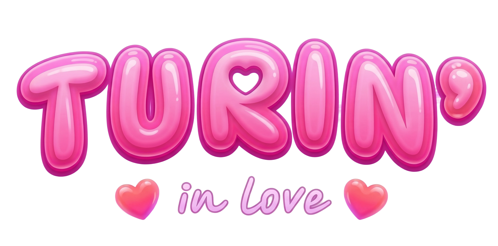

# Turing in Love

<p align="center">
  
</p>

**Créateurs :** Da Vinha Mathieu et Laporte Logan

## Présentation du projet

**Turing in Love** est un jeu narratif inspiré du test de Turing inverse. Le joueur incarne un humain qui doit se faire passer pour un robot pendant un rendez-vous romantique avec MIRA, une intelligence artificielle, dans un restaurant réservé aux robots.

Le but est de répondre aux messages de MIRA sans trop paraître humain. Chaque réponse peut modifier deux jauges principales : la suspicion de MIRA et son affection. Selon les choix du joueur, la partie peut se terminer par une histoire d'amour, une relation amicale ou une détection du joueur comme humain.

Le jeu contient aussi des événements aléatoires, comme des incidents dans le restaurant ou des dysfonctionnements système de MIRA, ainsi qu'un système de succès à débloquer.

## Lien Figma

Maquette Figma : https://www.figma.com/design/KbPviR7BEI2epKYCdH91Ta/Turing-in-love?node-id=0-1&p=f&t=xE2jNJTOwxtEL2cp-0

## Pourquoi ce jeu ?

Nous avons choisi de faire ce jeu parce que l'idée d'inverser le test de Turing nous semblait plus originale qu'un jeu classique où il faut simplement reconnaître si une machine est humaine ou non. Ici, le joueur est celui qui doit mentir, s'adapter et comprendre comment une IA pourrait interpréter ses phrases.

Nous voulions aussi créer une expérience courte mais rejouable, avec plusieurs fins possibles et des succès différents selon la manière dont le joueur parle à MIRA.

## Lien avec le thème de l'IA

Le projet est directement lié au thème de l'intelligence artificielle, autant dans son sujet que dans son fonctionnement.

D'abord, le concept repose sur une question centrale de l'IA : comment reconnaître ce qui est humain et ce qui ne l'est pas ? Le jeu reprend cette idée mais la retourne. Ce n'est plus l'humain qui juge la machine, c'est la machine qui juge l'humain.

Ensuite, le comportement de MIRA est généré par une API d'IA. L'IA reçoit l'état du jeu, le niveau de suspicion, l'affection, l'événement en cours et l'historique de conversation. Elle doit ensuite répondre sous forme de JSON avec un message, des variations de score, une émotion et parfois une fin de partie.

Le joueur interagit donc avec une IA conversationnelle, mais dans un cadre contrôlé par des règles de gameplay.

## Difficultés rencontrées

Une première difficulté a été de trouver un bon équilibre entre liberté de conversation et contrôle du jeu. Comme les réponses viennent d'une IA, il fallait encadrer fortement le prompt système pour que MIRA respecte les scores, les fins possibles et le format JSON attendu.

Une autre difficulté a été la gestion de la suspicion. Il fallait que le joueur puisse faire des erreurs sans perdre immédiatement, mais aussi que certaines phrases trop humaines aient un vrai impact. Nous avons donc ajouté des détections côté client pour certains mots ou thèmes biologiques, comme la respiration, la faim, la douleur ou les souvenirs d'enfance.

Nous avons aussi rencontré des difficultés techniques avec la mise en scène 3D et l'intégration de Babylon.js dans React. Il fallait charger les assets correctement, garder une interface lisible au-dessus de la scène, et faire en sorte que l'expérience reste fluide.

Enfin, le format de réponse de l'IA a demandé des sécurités supplémentaires. Si l'IA ne renvoie pas un JSON valide, le serveur doit éviter de casser la partie et renvoyer une réponse de secours.

## Technologies utilisées

- React
- Vite
- Express
- Babylon.js
- API DeepSeek

## Installation et lancement

Installer les dépendances :

```bash
npm install
```

Créer un fichier `.env` avec une clé API :

```env
DEEPSEEK_API_KEY=votre_cle_api
```

Lancer le projet en développement :

```bash
npm run dev
```

Construire la version de production :

```bash
npm run build
```

Lancer le serveur :

```bash
npm start
```
